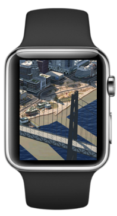

Project – 3D wearable
=====================

Use Case
--------
Today users are creating big city models for conceptual planning of infrastructure projects in industry standard software.

For consumation on wearable devices the model has to be exported, which will prepare the data for consumation on mobile and wearable devices.

Maintanance workers onsite will be able to get details about planned installations in 3D on a wearable device. The model can be explored in conjunction with a smart phone as well.

Minimize data transferred and memory footprint on wearable device
=================================================================
Goal of this project is the creation of a software to display a very large 3D model on a wearable device with a minimal memory footprint and a minimal amount of 3D model data transferred over the network. On the wearable device side a fast and slim visualization technique has to be developed within an application which is capable to navigate in 3D. For transferring the model data from a cloud component to the wearable device a mechanism has to be invented, which minimizes the amount of data transferred over the network. On the cloud a component has to provide and prepare the 3D model information in a way that makes consumption possible over the network, this component will be part of the project but focus of the project is the wearable device side.

Scope
-----
The scope of this project is a working prototype. The prototype will display an appropriately prepared large 3D model. The 3D model has to be explorable by navigating and by looking around. Example data used in this prototype will not be shared or published. The prototype should provide a touch and user friendly navigation functionality. The focus of the work will be to provide a fully working 3D viewer, highly interactive and fast. The viewer software should be developed in a componentized  manner, so that this wearable viewer component can be customized and reused. The project software provided will have a MIT license.

User Experience
---------------
3D navigation is hard on mobile devices. It is already much harder on smart phone devices than on desktops without the pointing devices available there. It is even harder on wearable devices, where the display is even smaller than on phones or tablets. The user experience for wearable 3D application is as of today a not very well explored area. UX for full free 3D navigation is a thing that has to be tailored for wearable devices. By adapting the navigation to wearable devices, the goal has to be to limit the functionality in a way that the user will not have the impression of limitation, but instead of a simplification. From a technical point of view we have to make use of this fact for optimization on the computing side to deliver an overall satisfying user experience.

Target platform
---------------
The wearable market is emerging, but there are the mobile iOS and the Android platforms which seem at the moment to be promising platforms for wearables as well. Tizen seems to become a serious challanger of these established platforms with interesting perspecitves. Ideally the application developed should be as easy as possible portable to all of these platforms. One of the three platforms will be chosen as the main target platform for this project as we go.

Disclaimer on cloud service parts
---------------------------------
This project will focus on the client side software and define a set of interfaces that it requires to communicate with a cloud component. The interacting cloud service parts and data will not be published and solely used for development and presentation purposes. This component will not be part of the prototype and might be hard wired to a given set of models or entirely mocked.

Deliverables
------------
The software and documentation will be provided in this GIT repository. It should have clear explanation and advise how the data required by the software has to be prepared and how the interfaces look like.
